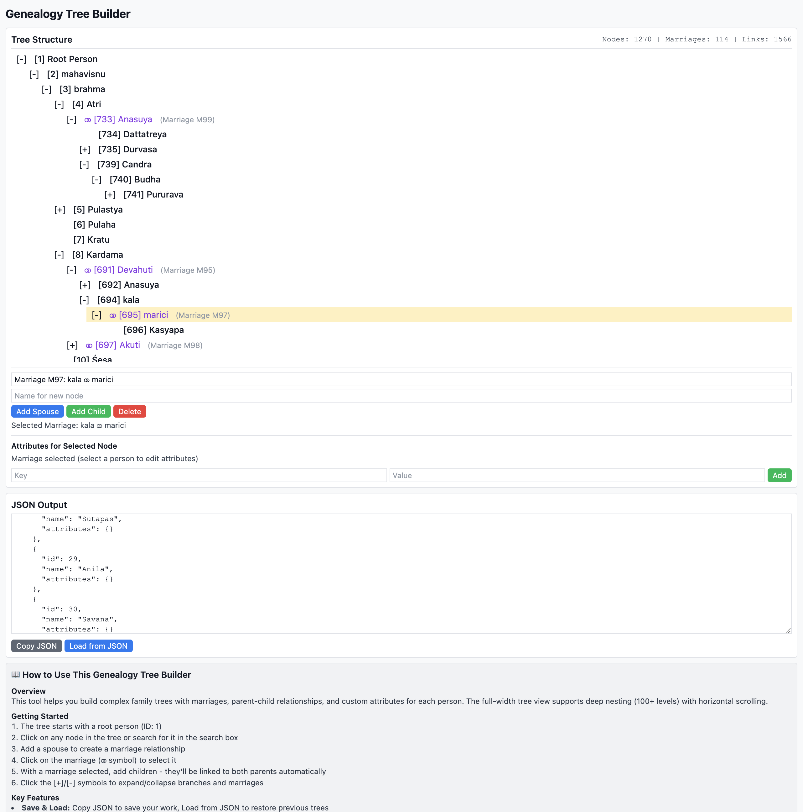

# Geneology Tool UI

This tool helps you build complex family trees with marriages, parent-child relationships, and custom attributes for each person. The full-width tree view supports deep nesting (100+ levels) with horizontal scrolling.

```sh
python3 -m http.server 8090
```

and go to [http://[::]:8090/builder.html](http://[::]:8090/builder.html).



### Proof it works?

See this genealogy ([data.json](data.json)) of given in [Mani's Puranic Encyclopaedia](https://archive.org/details/puranicencyclopa00maniuoft/page/900/mode/2up?view=theater) containing 1270+ nodes from Mahavisnu to Kaliyuga.

## Key Features

1. Save & Load: Copy JSON to save your work, Load from JSON to restore previous trees
2. Deep Nesting Support: Horizontal scrolling for trees that go 100+ levels deep
3. Marriage-based Children: Select a marriage (⚭) and add children to link them to both parents
4. Collapsible Marriages: Click [+]/[-] on marriages to show/hide their children
5. Delete Marriages: Select a marriage and click Delete to remove it (children become direct children of parents)
6. Searchable Nodes: Type to search through all nodes by name or ID
7. Custom Attributes: Select any person and add unlimited key-value pairs
8. Cascading Delete: Deleting a person also removes all their descendants

## JSON Structure

```json
{
  "nodes": [
    {
      "id": 1,
      "name": "Person Name",
      "attributes": {
        "birth": "1950",
        "occupation": "Engineer"
      }
    }
  ],
  "relationships": [
    {
      "id": "M1",
      "type": "marriage",
      "person1": 1,
      "person2": 2
    },
    {
      "type": "parent-child",
      "marriageId": "M1",
      "parent": 1,
      "child": 3
    }
  ]
}
```
